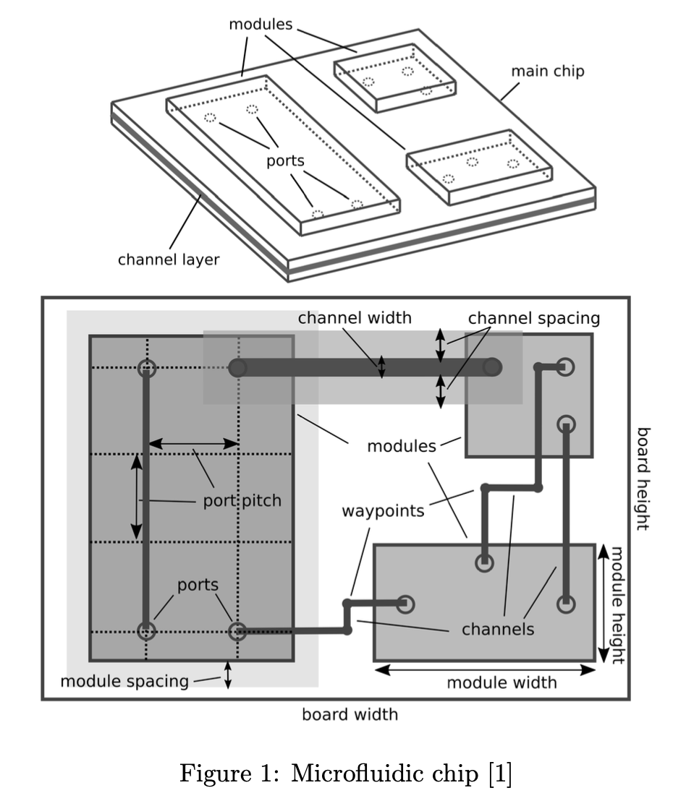

Problem 2: Routing for Microfluidic Devices
The ISO 22916:2022 standard provides a standardized description for microfluidic devices consisting of a main chip board and multiple modules. Fig. 1 shows an example of a microfluidic chip.

Given a microfluidic device with placed modules, this problem asks to route as many channels as possible without violating the ISO 22916:2022 standard. The main constraints are summarized as follows.

•	The number of waypoints of a routed channel should be smaller than a specified number. 

•	Segments of different channels should not overlap. 

•	There are minimum spacing constraints between segments and between segments and waypoints. Please refer to [1] for detailed descriptions of all constraints.

Reference:

[1] P. Ebner and R. Wille, ”Automatic Validation and Design of Microfluidic Devices Following the ISO 22916 Standard,” 2024 IEEE Computer Society Annual Symposium on VLSI (ISVLSI), Knoxville, TN, USA, 2024, pp. 278- 283, doi: 10.1109/ISVLSI61997.2024.00058.
